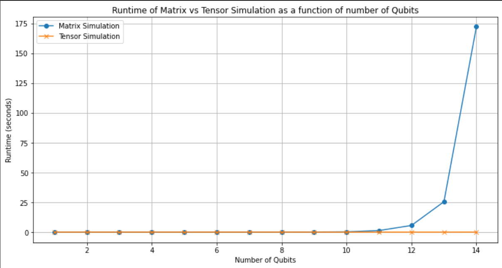

# Analysis of Quantum Circuit Simulations

This document provides an in-depth analysis of the performance and scalability of two quantum circuit simulation approaches: **Matrix Multiplication Simulation** and **Tensor Multiplication Simulation**. Both simulations were tested on various quantum circuit sizes to determine runtime performance.

---

## 1. Objective

The primary objective of this analysis is to compare the runtime and efficiency of:

1. **Naive simulation using matrix multiplication**: Using Kronecker products to model quantum state evolution.
2. **Advanced simulation using tensor multiplication**: Using tensor contraction methods for more efficient quantum state manipulation.

Each method was tested across a range of qubits to evaluate how well they scale and the maximum number of qubits they can handle in a reasonable time.

---

## 2. System Specifications

The analysis was performed on a system with the following specifications:

- Processor: Intel(R) Core(TM) i5-1035G1 CPU @ 1.00GHz   1.19 GHz
- RAM: 8.00 GB
- Operating System: Windows 10
- Python Version: 3.8.4
- Library Versions:
  - NumPy: 1.24.4
  - Matplotlib: 3.7.5

---

## 3. Simulation Implementation

### Matrix Simulator

The matrix simualtor simulates quantum circuits by applying quantum gates via matrix multiplication. Implementing this was very easy compared to tensor simulator. The implementation was completed quicky and less number of bugs were encountered during the process.

- **Tools**: NumPy's `np.kron` function for Kronecker products.

### Tensor Simulator

The tensor simulator models quantum circuits as multidimensional arrays (tensors), applying gates through tensor multiplication. Implementing this was harder than matrix simulator. Lot of bugs occured while developing it.

- **Tools**: NumPy's `np.tensordot` function for tensor contractions.

> *Note: Both the simulators are unit tested to ensure that they give to desired output. Unit tests are availabe in test directory*

---

## 4. Experimental Procedure

For a range of number of qubits :
1. **Initialize Quantum State**: Both simulations start with a predefined quantum state vector.
2. **Apply Gates**: Sequentially apply a series of gate:
- *For Odd Qubits*: Apply Hadamard gate.
- *For Even Qubits*: Apply CNOT gate (target qubit = even qubit, control qubit = previous odd qubit)
3. **Measure Runtime**: Record the runtime as a function of the number of qubits.

Plot the runtimes as a function of number of qubits.

---

## 5. Results

### Runtime Performance

The following chart shows the runtime of each simulation w.r.t. number of qubits:

| Number of Qubits | Matrix Simulation Runtime | Tensor Simulation Runtime |
| ---------------- | ------------------------- | ------------------------- |
| 1                | 0.000931                  | 0.000363                  |
| 2                | 0.001052                  | 0.000499                  |
| 3                | 0.002485                  | 0.001025                  |
| 4                | 0.001329                  | 0.000997                  |
| 5                | 0.004000                  | 0.000999                  |
| 6                | 0.004920                  | 0.002000                  |
| 14               | 204.168515                | 0.003535                  |
| 15               | -                         | 0.006733                  |
| 20               | -                         | 0.228895                  |
| 25               | -                         | 10.583867                 |
| 29               | -                         | 677.839113                |

> *Note: The runtimes in the above tabel are in seconds and rounded up to 6 decimal places*

### How Many Qubits Can Each Simulation Handle?

- The matrix simulator can simulate upto **14 qubits**.
- The tensor simulation can simulate upto **29 qubits**.

### Plotting runtimes as a function of number of qubits

---

## 6. Discussion

- **Advantages of Matrix Simulation**:

  - Easier to implement and understand.
- **Advantages of Tensor Simulation**:

  - More memory-efficient due to multidimensional representation.
  - Has less runtime and scales better with the number of qubits.

---

## 7. Conclusion

This analysis shows that while both methods have their advantages, **tensor simulation** generally scales better for larger quantum circuits due to its efficient use of memory. It is more complex to implement but it pays of in it's performance.

---

## 8. Future Work

- **Extended Gate Library** : Expand the library to include more quantum gates like `SWAP`, `Toffoli`, and custoom gates, allowing for more complex circuit designs.
- **Visualization Tools** : Develop a visualizer to display the state of the quantum system at each step in the circuit.
